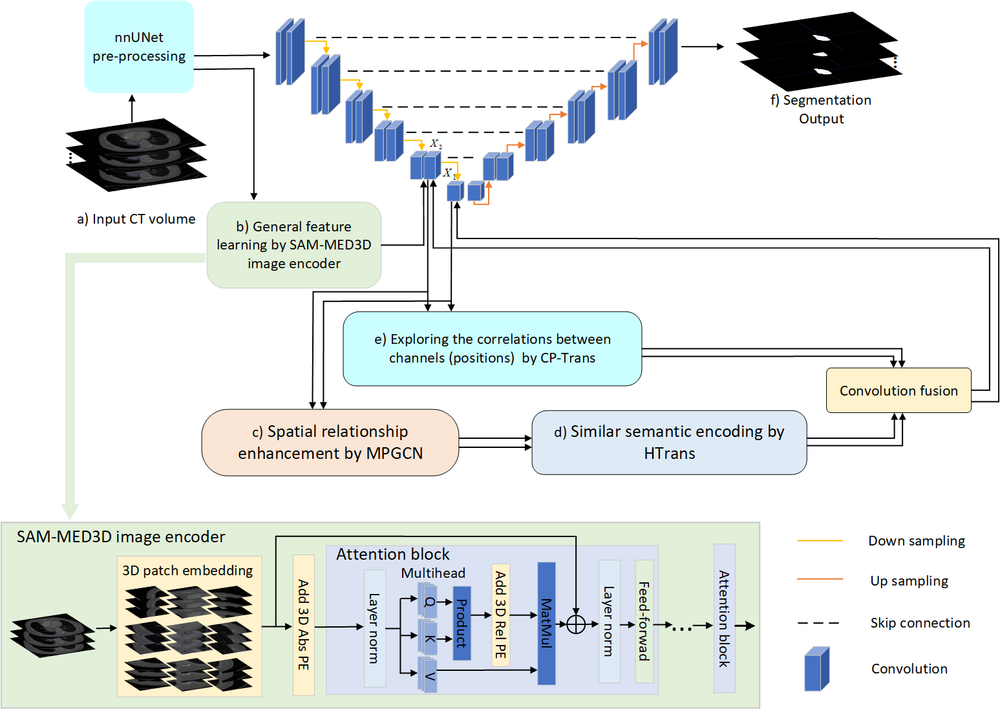
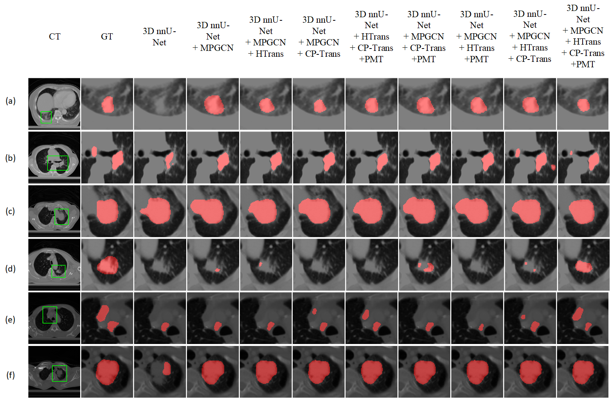
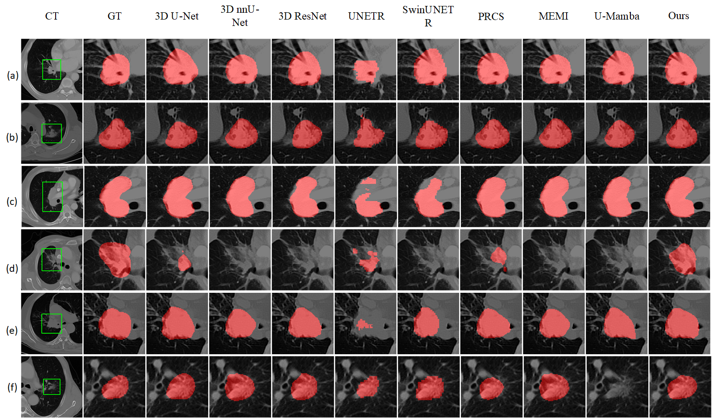

# MPGCN-DHT: A multi-perspective GCN and dynamic hypergraph-transformer feature learning model for CT segmentation
Built upon [MIC-DKFZ/nnUNet](https://github.com/MIC-DKFZ/nnUNet), this repository provides the official PyTorch implementation of MPGCN-DHT.

## How to use MPGCN-DHT
### 1. Requirements:
Linux, Python3.9, Pytorch1.12.0
### 2. Installation:
* Install nnU-Net as below
```
git clone https://github.com/MIC-DKFZ/nnUNet.git
cd nnUNet
pip install -e .
```

* Copy the python files in folder network_architecture to nnunet/network_architecture
* Load Pre-trained SAM-Med3D Checkpoint
```
wget -O nnUNet/nnunet/network_architecture/Med3D/Param/sam_med3d_turbo.pth "https://huggingface.co/blueyo0/SAM-Med3D/resolve/main/sam_med3d_turbo.pth"
```
## Example results  

- Framework of the proposed MPGCN-DHT model.


- Comparison of lung tumor segmentation results using various models: the baseline 3D nnU-Net, 3D nnU-Net with multi-perspective graph convolutional network (MPGCN), 3D nnU-Net with MPGCN and hypergraph transformer (HTrans), 3D nnU-Net with MPGCN and channel-position transformer (CP-Trans), 3D nnU-Net with HTrans and CP-Trans, and our final model combining MPGCN, HTrans, CP-Trans, and PMT. Additionally, results from the final model with MPGCN, HTrans, CP-Trans, or PMT removed individually are included. Lung tumors are marked in red.


- Segmentation cases of MPGCN-DHT models (ours) embedded into 3D U-Net, 3D ResNet, and 3D nnU-Net. Red indicates the segmented lung tumor region..


- Six cases with manual delineation results (GT) and the segmentation results by our model and other comparing models on the SDCH dataset. The lung tumor segmented by each model are shown in red color.

## Dataset
[structseg2019-LT](https://structseg2019.grand-challenge.org/Home/),in-house SDCH-LT dataset

## Citation
If you find this repository useful, please consider citing our paper:
```
@inproceedings{
xuan2022prcs,
title={Convolutional bi-directional learning and spatial enhanced attentions for lung tumor segmentation},
author={Ping Xuan and Bin Jiang and Hui Cui and Qiangguo Jin and Peng Cheng and Toshiya Nakaguchi and Tiangang Zhang and Changyang Li and Zhiyu Ning and Menghan Guo and Linlin Wang},
booktitle={Computer Methods and Programs in Biomedicine(under review)},
year={2022}
}
```
